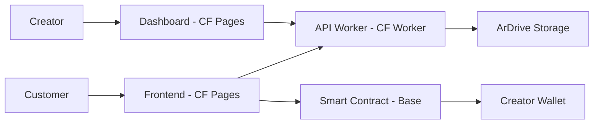

# 🎂 Birthday Songs - Decentralized NFT Marketplace

> **Fully decentralized birthday song NFT marketplace with end-to-end encryption**

[](https://cloudflare.com)
[](LICENSE)
[](https://ardrive.io)
[](https://base.org)

## ✨ What This Is

A **production-ready** Web3 application where customers can:
- Order custom birthday songs as NFTs
- Pay with USDC on Base L2
- Receive encrypted songs stored permanently on Arweave
- Transfer/sell NFTs with song access intact

Creators (like Jose) can:
- View encrypted orders through admin dashboard  
- Upload songs that only NFT holders can decrypt
- Earn money directly without platform middlemen

## 🏗️ Architecture



## 🚀 Tech Stack

| Component | Technology | Purpose |
|-----------|------------|---------|
| **Frontend** | Next.js 15 + Cloudflare Pages | Customer ordering interface |
| **Dashboard** | Next.js 15 + Cloudflare Pages | Creator admin panel |
| **API** | Cloudflare Workers | Serverless ArDrive operations |
| **Blockchain** | Base L2 + Solidity | USDC payments & NFT minting |
| **Storage** | ArDrive + Turbo SDK | Encrypted permanent storage |
| **Database** | Cloudflare D1 | Order metadata & status |

## 📁 Project Structure

```
birthday-songs-monorepo/
├── apps/
│   ├── customer-app/          # Customer frontend (Cloudflare Pages)
│   ├── jose-dashboard/        # Creator dashboard (Cloudflare Pages)
│   └── api-worker/           # Serverless API (Cloudflare Worker)
├── contracts/
│   └── BirthdaySongs.sol     # Smart contract (Base L2)
├── packages/
│   ├── shared/               # Shared types & utilities
│   └── encryption/           # ArDrive encryption logic
├── infra/
│   ├── deploy/               # Deployment automation
│   └── docs/                 # Architecture documentation
└── README.md                 # You are here
```

## 🔧 Quick Start

### Prerequisites

- Node.js 18+
- Cloudflare CLI (`npm install -g wrangler`)
- MetaMask or compatible wallet
- Base testnet ETH for testing

### 1. Clone & Install

```bash
git clone https://github.com/your-username/birthday-songs
cd birthday-songs-monorepo
npm install
```

### 2. Environment Setup

```bash
# Copy environment files
cp apps/customer-app/.env.example apps/customer-app/.env.local
cp apps/jose-dashboard/.env.example apps/jose-dashboard/.env.local
cp apps/api-worker/.env.example apps/api-worker/.env

# Add your keys:
# - ARWEAVE_PRIVATE_KEY
# - CLOUDFLARE_API_TOKEN
# - CONTRACT_ADDRESS (after deployment)
```

### 3. Deploy Smart Contract

```bash
cd contracts
forge create BirthdaySongs.sol:BirthdaySongs \
  --rpc-url https://sepolia.base.org \
  --private-key YOUR_PRIVATE_KEY \
  --constructor-args USDC_ADDRESS YOUR_WALLET
```

### 4. Deploy Everything

```bash
npm run deploy:all
```

### 5. Fund ArDrive Wallet

```bash
# Fund with $10 ETH for ~1000 song uploads
npx wrangler kv:namespace put "CREDITS" "funded" --binding="SETTINGS"
```

## 💡 How It Works

### For Customers

1. **Order**: Fill form with birthday details
2. **Pay**: USDC payment on Base L2 mints NFT
3. **Encrypt**: Order data encrypted with creator's key
4. **Store**: Encrypted order stored permanently on ArDrive
5. **Wait**: Creator receives notification to fulfill
6. **Download**: Song encrypted with NFT-specific key
7. **Own**: NFT transferable, song access transfers too

### For Creators

1. **View Orders**: Dashboard shows encrypted orders to fulfill
2. **Decrypt**: Use creator key to view order details
3. **Create**: Make the custom birthday song
4. **Upload**: Song encrypted for NFT holder only
5. **Fulfill**: Update NFT metadata with song location
6. **Earn**: Automatic payment to creator wallet

## 🛡️ Security Model

### Encryption Layers

- **Order Data**: AES-256-GCM with creator's master key
- **Song Files**: AES-256-GCM with NFT-specific keys
- **Key Management**: Derived from NFT ownership + creator signature
- **Storage**: All encrypted data stored on Arweave (permanent)

### Access Control

| Data Type | Who Can Decrypt | Key Source |
|-----------|----------------|------------|
| Order details | Creator only | Master password |
| Song files | Creator OR NFT holder | Token-specific key |
| NFT metadata | Public | On-chain |

## 🚀 Deployment

### Cloudflare Setup

```bash
# 1. Deploy API Worker
cd apps/api-worker
wrangler deploy

# 2. Deploy Customer Frontend
cd apps/customer-app  
npm run build
wrangler pages deploy dist

# 3. Deploy Dashboard
cd apps/jose-dashboard
npm run build
wrangler pages deploy dist
```

### Production Checklist

- [ ] Smart contract deployed to Base mainnet
- [ ] ArDrive wallet funded with credits
- [ ] Cloudflare Workers deployed
- [ ] DNS configured for custom domains
- [ ] Environment variables set
- [ ] Test full order → fulfillment → download flow

## 💰 Economics

### Storage Costs (ArDrive)
- **Order data**: ~1KB = $0.000006 (practically free)
- **Song file**: ~5MB = $0.03-0.04 each
- **Permanent**: Stored forever, no recurring fees

### Network Costs (Base L2)
- **Mint NFT**: ~$0.001 gas
- **Transfer NFT**: ~$0.001 gas
- **USDC payment**: ~$0.001 gas

### Revenue Model
- **Creator sets price**: $25 (birthday) or $250 (astrology)
- **Platform fee**: 0.1% (covers infrastructure)
- **Creator gets**: 99.9% of payment

## 🔮 Roadmap

- [x] Core MVP with ArDrive encryption
- [x] Cloudflare Workers API
- [x] Admin dashboard for creators
- [x] Base L2 smart contract
- [ ] Multi-creator marketplace
- [ ] Mobile app (React Native)
- [ ] Integration with streaming platforms
- [ ] Advanced astrology features
- [ ] Creator analytics dashboard

## 🤝 Contributing

We love contributions! This project is open source and welcomes:

- 🐛 Bug reports and fixes
- 🚀 Feature requests and implementations  
- 📖 Documentation improvements
- 🎨 UI/UX enhancements
- 🔐 Security audits

See [CONTRIBUTING.md](CONTRIBUTING.md) for guidelines.

## 📜 License

MIT License - see [LICENSE](LICENSE) for details.

## 🙏 Acknowledgments

- **[ArDrive](https://ardrive.io)** - Permanent encrypted storage
- **[Base](https://base.org)** - L2 blockchain infrastructure  
- **[Cloudflare](https://cloudflare.com)** - Edge computing platform
- **[OpenZeppelin](https://openzeppelin.com)** - Smart contract security

---

**Built with ❤️ by Jose & Dylan**

*Making personalized music permanently accessible through Web3*